# #DISCIPLINE (aka NumDiscipline)

A modified version of the great looking Discipline through hole keyboard design by coseyfannitutti to add numpad. 

## Modifications from original Discipline 

- Add numpad on right.
- Move arrow keys 0.25U down and right, similar to 1800 layout. 
- Adjust component layout on top of board, moving ATMega and buttons to the right, adding in more diodes in center. 
- Removed ~, Delete, Page Up, Page Down keys. These will be on alternate layer. 
- Created Digikey version of BOM, found here: https://octopart.com/bom-tool/AgAHKWUi

## ToDo 
- Assemble proto with full build including switch plate and bottom plate. (
- Cut and assemble acrylic gaurd and feet. 
- add Via support
- Next order of PCBs: 
	- Adjust #DISCIPLINE logo in space bar area so that it doesn't overlap stablaizer. 
	- Omit job number silk screen from vendor. 
	- Improve surface finish on black solder mask, some dark spots.
	- Remove drills from FR4 switch plate.

## Images

#### Prototype Build
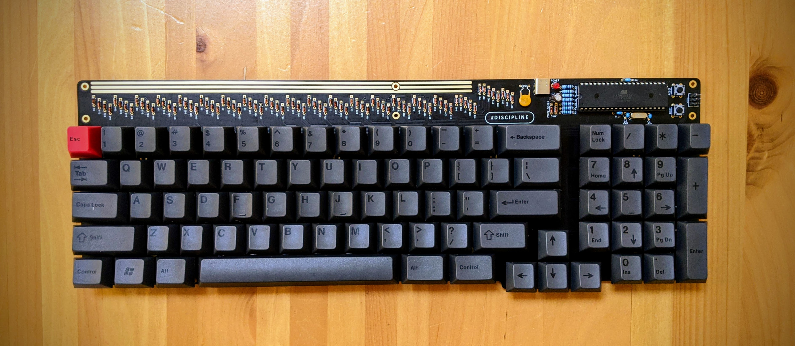
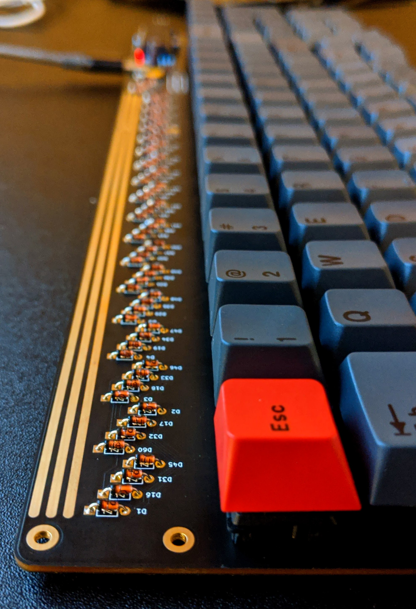

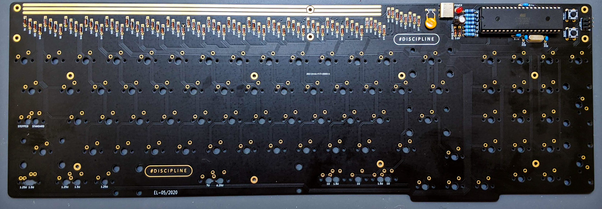
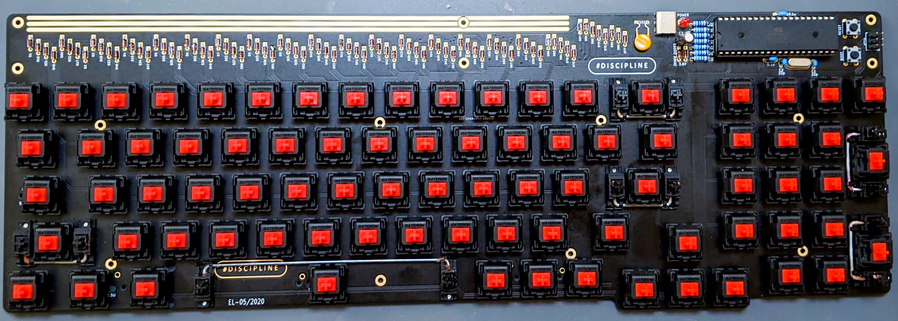

#### Layout
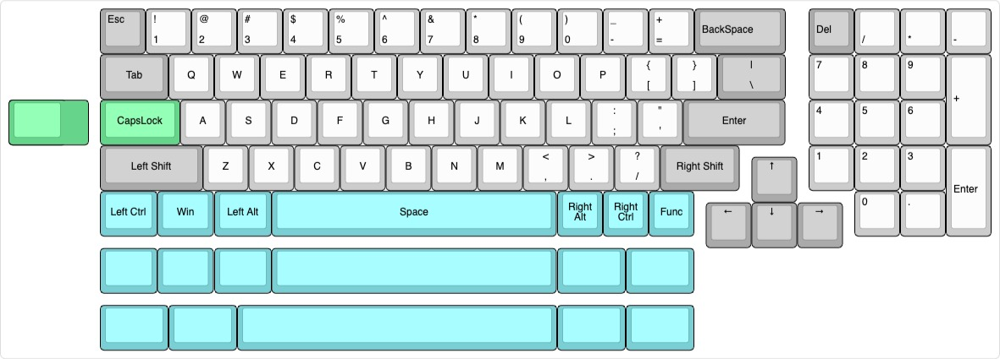

#### Main PCB
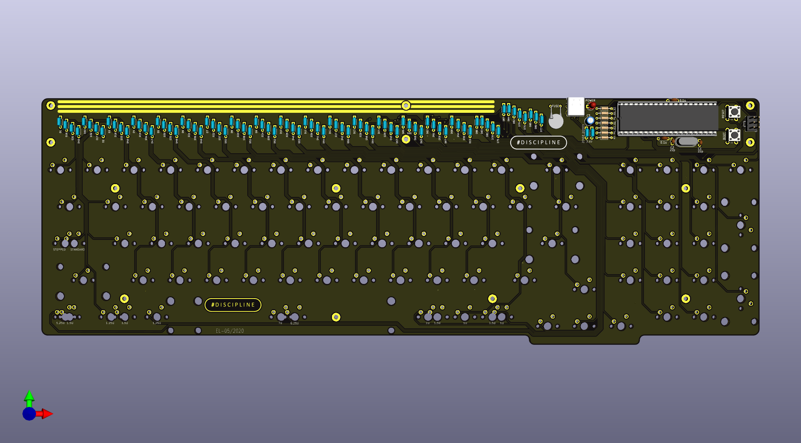

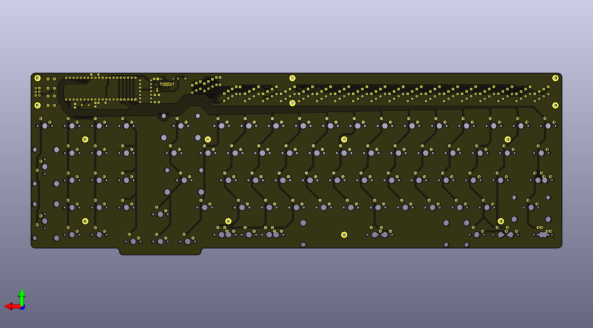

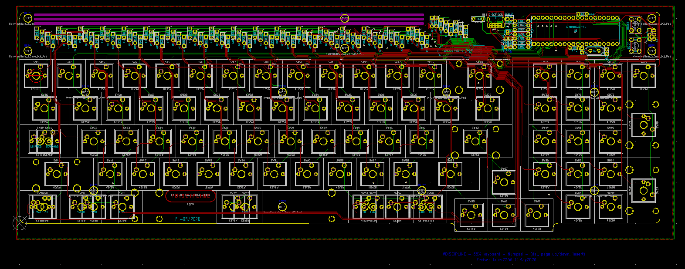

#### FR4 Plate
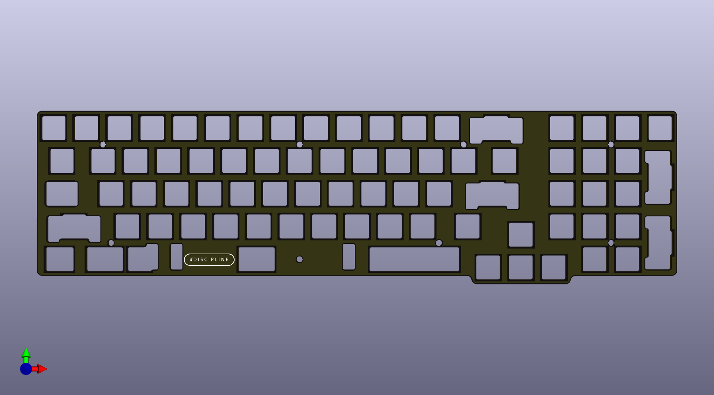

#### Bottom PCB
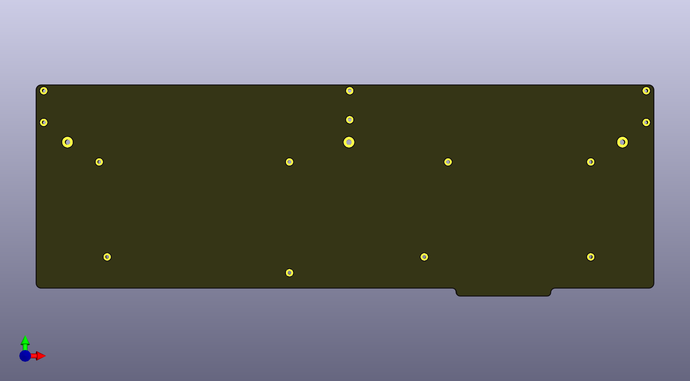

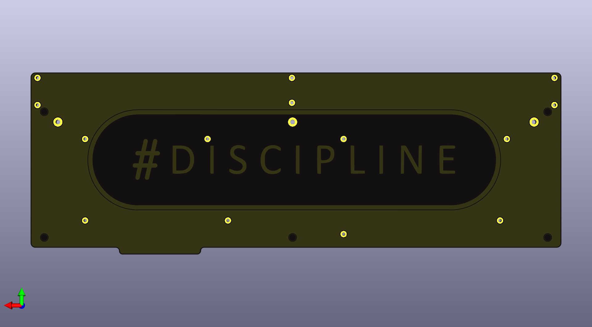

